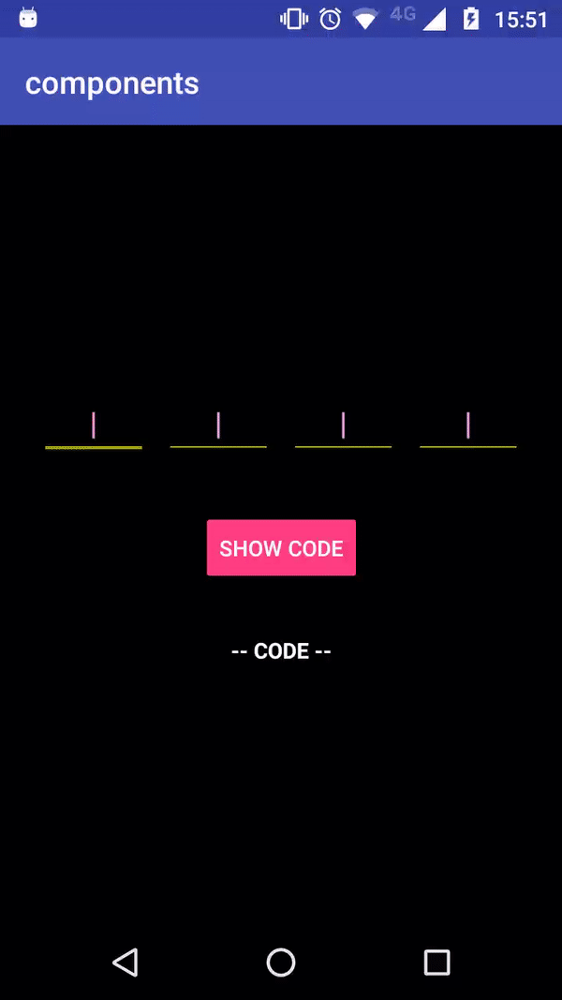

# OtpView Component
Easy capturing OTP codes of n digits with the selected customization


## Customization
- Text color
- Text size
- Underline color
- Placeholder color and text
- Number of fields
- Space between fields

## How to use it
1. Import the library component (see library README)
2. Create the component view on the XML file as follows:
```xml
<banlinea.mobile.components.otp.OtpView xmlns:otp="http://schemas.android.com/apk/res-auto"
        android:id="@+id/otpView"
        android:layout_width="match_parent"
        android:layout_height="wrap_content"
        otp:hint="|"
        otp:hintColor="#eeaaee"
        otp:size="4"
        otp:spaceBetween="10dp"
        otp:textColor="#ff00ff"
        otp:textSize="20sp"
        otp:tintColor="#aa0"/>
```

The table explains each attribute:

|     Attribute     |           Description           |
| ----------------- | ------------------------------- |
| hint              | Sets the placeholder symbol     |
| hintColor         | Sets the placeholder color      |
| size              | Sets the number of fields       |
| spaceBetween      | Sets the margin beteween fields |
| textColor         | Sets the text color             |
| textSize          | Sets the text size dimensions   |
| tintColor         | Sets the underline color        |

3. Customize what you need with the custom attributes
4. Enjoy!
5. <uses-permission android:name="android.permission.RECEIVE_SMS"></uses-permission>
   <uses-permission android:name="android.permission.READ_SMS" />

